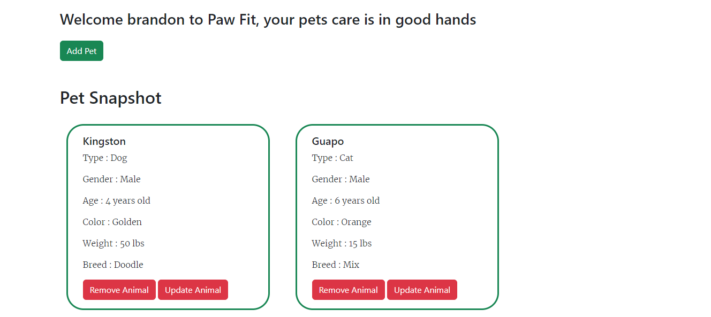
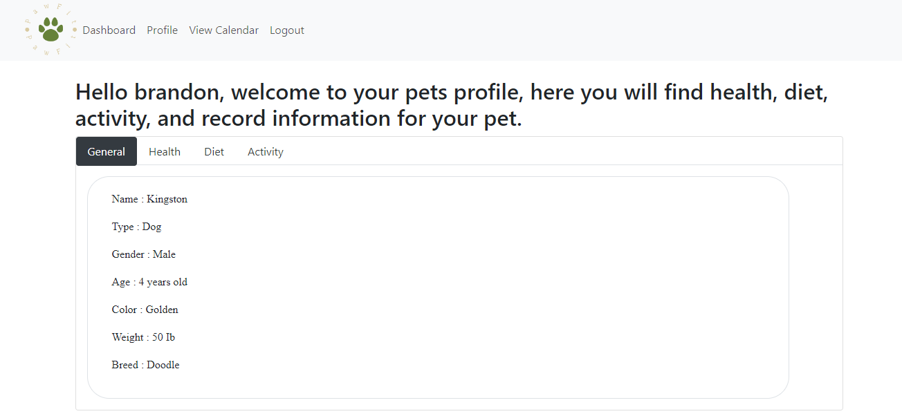

# Paw Fit

## Description

Welcome to Paw Fit, a web application to keep track of all your furry friends health and data records. In this repository the user will first run the server in the terminal, next create a user profile and finally add your pet to your profile. The user will add health, diet and activity information to display an overall picture of each pets health.

Technologies used include:

- Node.js
- Express.js
- Helmet npm package
- Nodemon
- MySQL
- Sequelize
- Handlebars.js
- Express-session and cookies
- MVC paradigm

## Table of Contents

[License](#license)

[Installation](#installation)

[Usage](#usage)

[Deploy](#deploy)

## License

None

## Installation

To install necessary dependencies, run the following command:

- npm i

## Usage

To use the application type the following into the terminal

- npm run watch

# Deploy

Below you find a snapshot of the profile page and a deployment link

Deployment Link :

Dashboard page displays a snapshot of pets information
Image

Profile page displaying general health, diet, and activity information
Image
